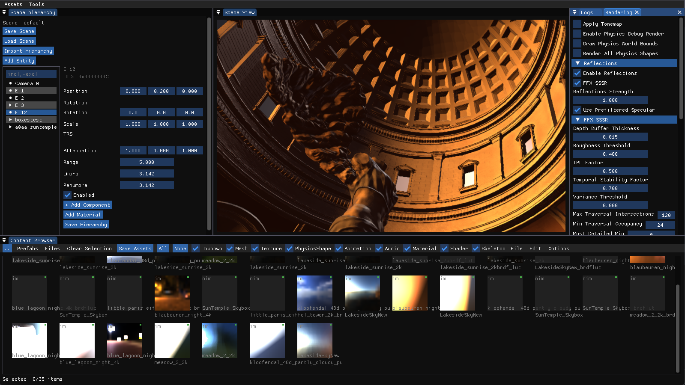
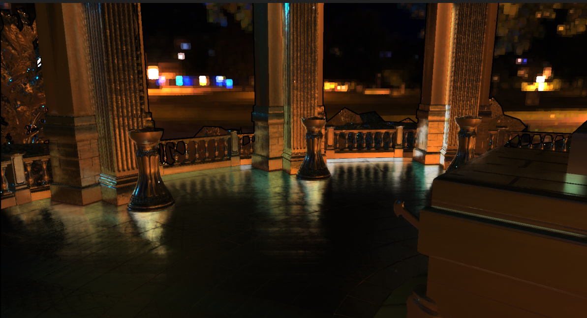
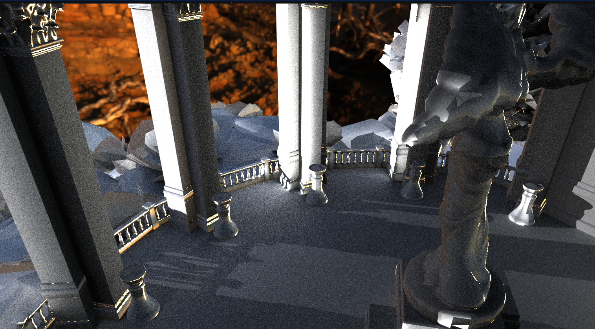
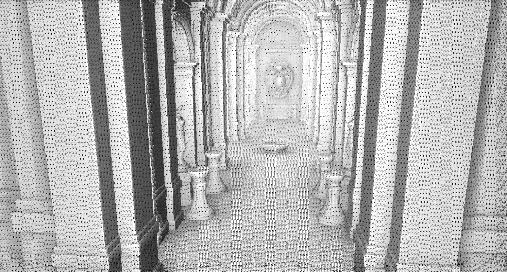
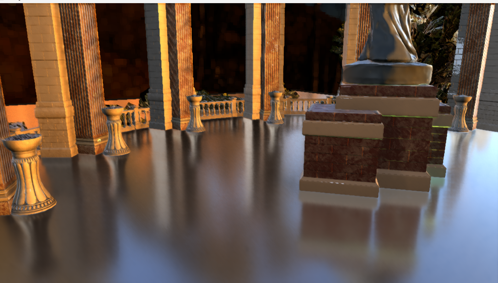
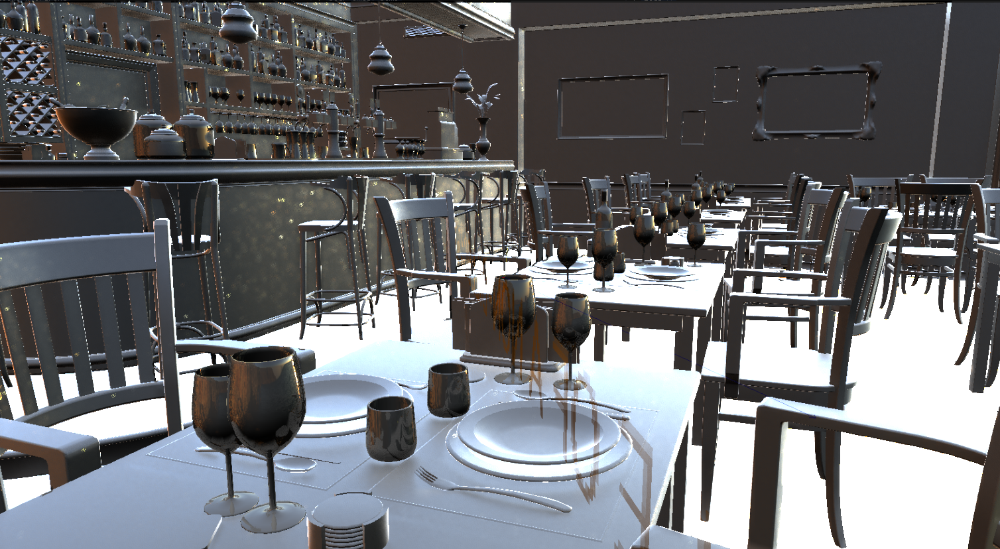

# MofuEngine

A small game and rendering engine written entirely in C++

Built primarily for personal experimentation, although the possibility of eventually producing a shippable application is not ruled out.

Currently, the only supported graphics backend is Direct3D12.

## Editor
The editor is pure ImGui, with a customizable docking layout. 

Currently supports most of the basic asset, scene, material and entity management operations.

## Some more notable renders

#### DXR Path Tracing

##### An implementation of SSILVB

##### Reflections - AMD FidelityFX SSSR

### ECS
Features my own ECS inspired mainly by Unity DOTS

Currently looking for possibilities of making it more GPU-driven

### Physics
The engine uses Jolt for it's physics simulation.

